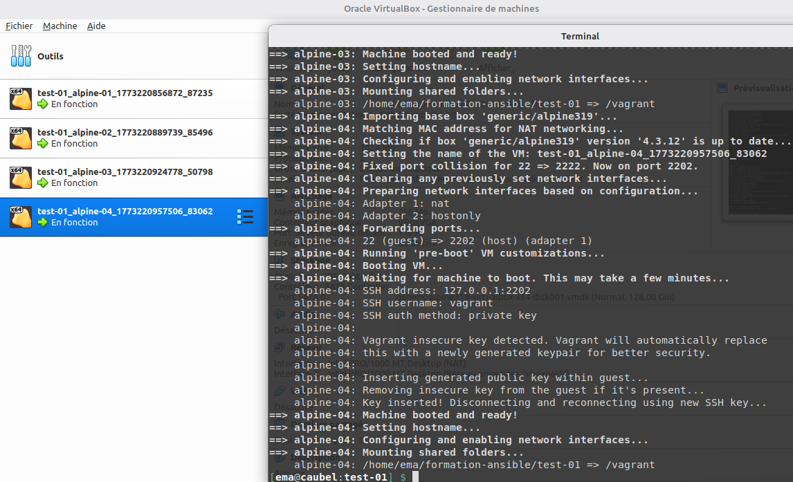
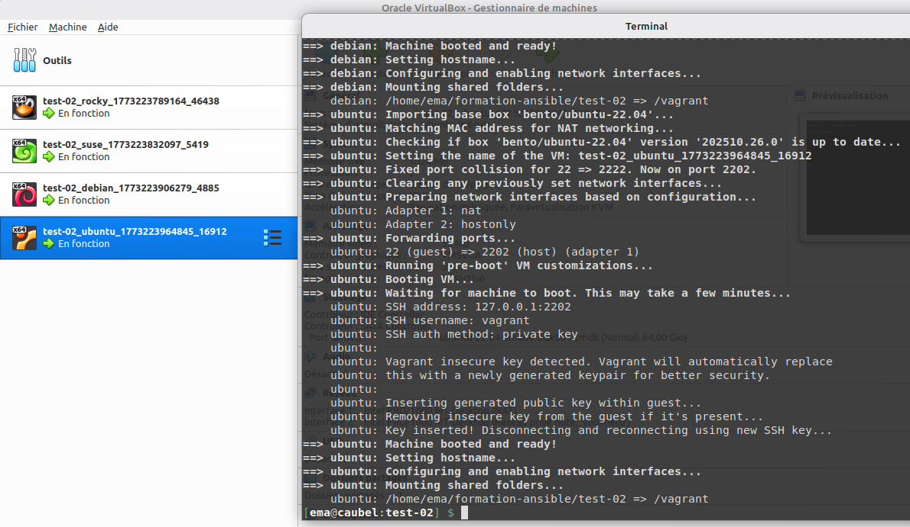

# Ansible-kovacs

## Information

Tout les éléments suivant proviennent du site de formation : [MicroLinux](https://formations.microlinux.fr/ansible/labo)

Les checks suivants, proviennent du repository GitLab suivant : [kikinavak/formation-ansible](https://gitlab.com/kikinovak/formation-ansible)

## Test-01 Création des VMs

> Commande de lancement : `vagrant up`




### Check d'accessibilité

```bash
[ema@caubel:~] $ ping -c 1 -q 192.168.56.10
PING 192.168.56.10 (192.168.56.10) 56(84) bytes of data.

--- 192.168.56.10 ping statistics ---
1 packets transmitted, 1 received, 0% packet loss, time 0ms
rtt min/avg/max/mdev = 0.354/0.354/0.354/0.000 ms
[ema@caubel:~] $ ping -c 1 -q 192.168.56.20
PING 192.168.56.20 (192.168.56.20) 56(84) bytes of data.

--- 192.168.56.20 ping statistics ---
1 packets transmitted, 1 received, 0% packet loss, time 0ms
rtt min/avg/max/mdev = 0.246/0.246/0.246/0.000 ms
[ema@caubel:~] $ ping -c 1 -q 192.168.56.30
PING 192.168.56.30 (192.168.56.30) 56(84) bytes of data.

--- 192.168.56.30 ping statistics ---
1 packets transmitted, 1 received, 0% packet loss, time 0ms
rtt min/avg/max/mdev = 0.244/0.244/0.244/0.000 ms
[ema@caubel:~] $ ping -c 1 -q 192.168.56.40
PING 192.168.56.40 (192.168.56.40) 56(84) bytes of data.

--- 192.168.56.40 ping statistics ---
1 packets transmitted, 1 received, 0% packet loss, time 0ms
rtt min/avg/max/mdev = 0.218/0.218/0.218/0.000 ms
```

> Commande de suppression : `vagrant destroy -f`

## Test-02

### Ajout des différentes box

```bash
vagrant box add bento/rockylinux-9
vagrant box add bento/debian-12
vagrant box add bento/opensuse-leap-15
vagrant box add bento/ubuntu-22.04
```

### Vérification 



> Suppression du test : `vagrant destroy -f`

## Atelier-01 Installation d'Ansible

### Challenge 1

#### Consigne

- Démarrez la VM ubuntu depuis le répertoire atelier-01.

```bash
vagrant up ubuntu
```

- Connectez-vous à cette VM.

```bash
vagrant ssh ubuntu
```

- Rafraîchissez les informations sur les paquets.

```bash
sudo apt update
```

- Recherchez le paquet ansible avec les options qui vont bien.

```bash
sudo apt search --names-only ansible

>>> ansible/jammy 2.10.7+merged+base+2.10.8+dfsg-1 all
    Configuration management, deployment, and task execution system
```

- Installez le paquet officiel fourni par la distribution.

```bash
sudo apt install -y ansible
```

- Notez la version d'Ansible.

```bash
vagrant@ubuntu:~$ ansible --version
ansible 2.10.8
  config file = None
  configured module search path = ['/home/vagrant/.ansible/plugins/modules','/usr/share/ansible/plugins/modules']
  ansible python module location = /usr/lib/python3/dist-packages/ansible
  executable location = /usr/bin/ansible
  python version = 3.10.12 (main, Aug 15 2025, 14:32:43) [GCC 11.4.0]

```

- Déconnectez-vous et supprimez la VM.

```bash
exit
vagrant destroy -f ubuntu
```


### Challenge 2

- Répétez le challenge précédent en configurant un dépôt PPA (Personal Package Archive) pour Ansible

```bash
sudo apt-add-repository ppa:ansible/ansible
sudo apt update
sudo apt search --names-only ansible
sudo apt install ansible # Package PPA

>>> vagrant@ubuntu:~$ ansible --version 
ansible [core 2.17.14]
  config file = /etc/ansible/ansible.cfg
  configured module search path = ['/home/vagrant/.ansible/plugins/modules','/usr/share/ansible/plugins/modules']
  ansible python module location = /usr/lib/python3/dist-packages/ansible
  ansible collection location = /home/vagrant/.ansible/collections:/usr/share/ansible/collections
  executable location = /usr/bin/ansible
  python version = 3.10.12 (main, Aug 15 2025, 14:32:43) [GCC 11.4.0] (/usr/bin/python3)
  jinja version = 3.0.3
  libyaml = True

```

> NOTE :  
> La version proposé par la distribution est plus vielle (2.10.8) contre une version 2.17.14 pour la version donnée par le rero `PPA`.  

- Notez la version fournie par ce dépôt tiers et comparez avec la version officielle du challenge précédent.

### Challenge 3

- Lancez une VM Rocky Linux et installez Ansible en utilisant PIP et Virtualenv.

```bash
vagrant up rocky
sudo yum update
sudo yum install -y python3-pip 
python3 -m venv ~/.venv/ansible
source ~/.venv/ansible/bin/activate
pip install --upgrade pip
pip install ansible
ansible --version

>>> (ansible) [vagrant@rocky ~]$ ansible --version
  ansible [core 2.15.13]
  config file = None
  configured module search path = ['/home/vagrant/.ansible/plugins/modules', '/usr/share/ansible/plugins/modules']
  ansible python module location = /home/vagrant/.venv/ansible/lib64/python3.9/site-packages/ansible
  ansible collection location = /home/vagrant/.ansible/collections:/usr/share/ansible/collections
  executable location = /home/vagrant/.venv/ansible/bin/ansible
  python version = 3.9.25 (main, Jan 14 2026, 00:00:00) [GCC 11.5.0 20240719 (Red Hat 11.5.0-11)] (/home/vagrant/.venv/ansible/bin/python3)
  jinja version = 3.1.6
  libyaml = True


```
