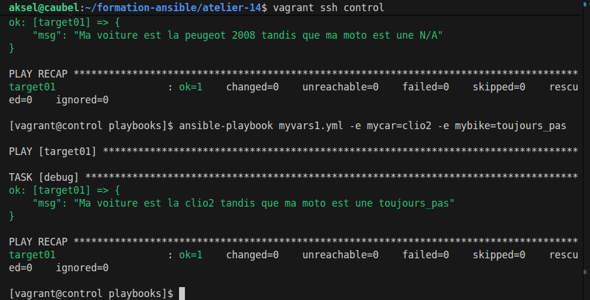
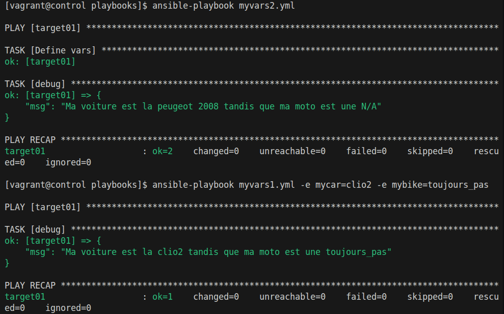
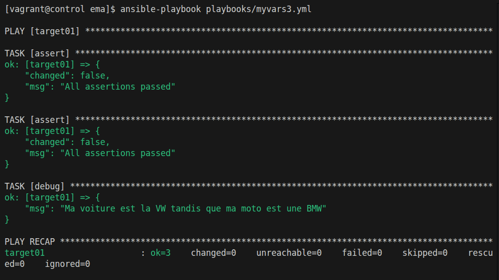
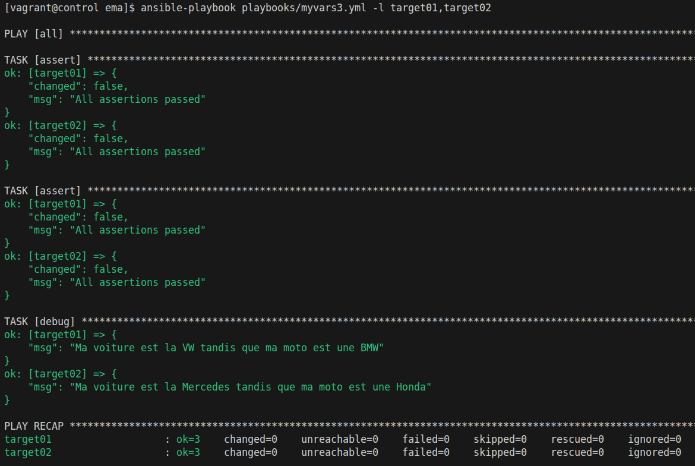
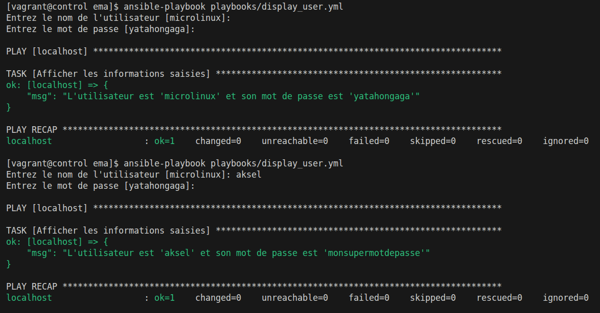

# Les variables

Dossier de travail : `formation-ansible/atelier-14/`

Répertoire de travail dans la vm vagrant ansible : `~/ansible/projets/ema`

## Play-vars

```yml
--- # myvars1.yml

- hosts : target01
  gather_facts: false

  vars:
    mycar: peugeot 2008
    mybike: N/A

  tasks:

    - debug:
        msg: Ma voiture est la {{ mycar }} tandis que ma moto est une {{ mybike }}
```

**Output + surcharge**


## Set_fact

```yml
--- # myvars2.yml

- hosts : target01
  gather_facts: false

  tasks:

    - name : Define vars
      set_fact:
        mycar: peugeot 2008
        mybike: N/A

    - debug:
        msg: Ma voiture est la {{ mycar }} tandis que ma moto est une {{ mybike }}
```

**Output + surcharge**



## Group-vars

### All

> Définition du fichier `group_vars/all.yml` au même niveau que l'inventaire

```yml
---  # group_vars/all.yml

mycar: "VW"
mybike: "BMW"
```

```yml
--- # myvars3.yml

- hosts : target01
  gather_facts: false

  tasks:

    - assert:
        that:
          - mycar is defined
        fail_msg: The mycar variable is undefined or empty.

    - assert:
        that:
          - mybike is defined
        fail_msg: The mybike variable is undefined or empty.

    - debug:
        msg: Ma voiture est la {{ mycar }} tandis que ma moto est une {{ mybike }}
```

**Output uniquement sur target01 pour ne pas surcharger l'output**


### By Target

Création d'un fichier `host_vars/target02`

```yml
---  # host_vars/target02.yml

mycar: "Mercedes"
mybike: "Honda"
```

Changement dans le playbook de la cible `target01` -> `all` et ajout dans la commande de la limite host avec `-l` pour n'avoir que 2hosts 



## Var prompt

Utilisation de Var_prompt sur l'utilisateur local car aucune plus value de le lancer sur un target.

```yml
--- # display_user.yml

- hosts: localhost
  gather_facts: false

  vars_prompt:
    - name: user
      prompt: "Entrez le nom de l'utilisateur"
      default: "microlinux"
      private: false

    - name: password
      prompt: "Entrez le mot de passe"
      default: "yatahongaga"
      private: true

  tasks:
    - name: Afficher les informations saisies
      debug:
        msg: "L'utilisateur est '{{ user }}' et son mot de passe est '{{ password }}'"
```

**Ouput**
