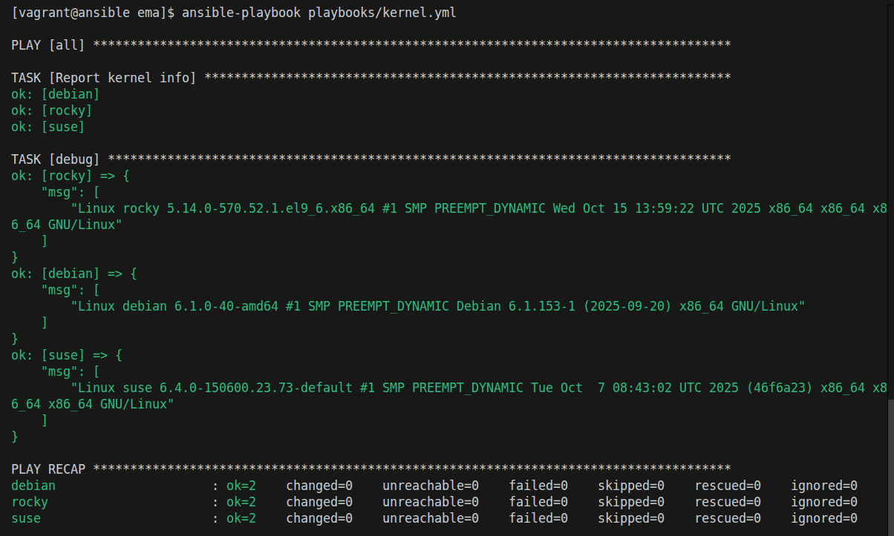
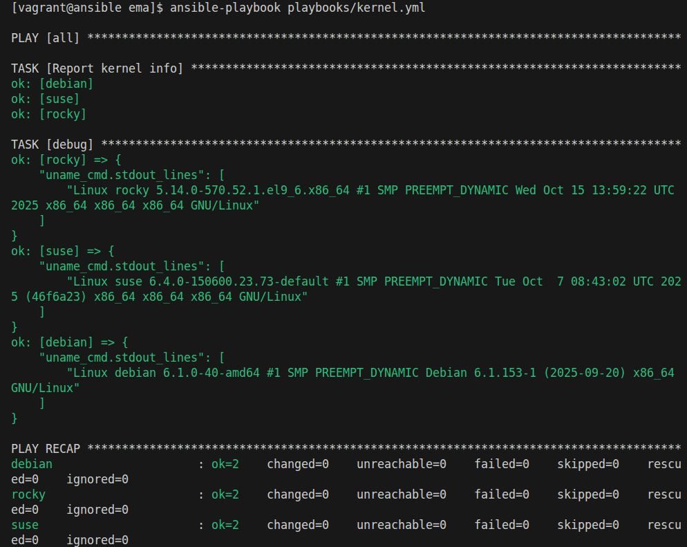
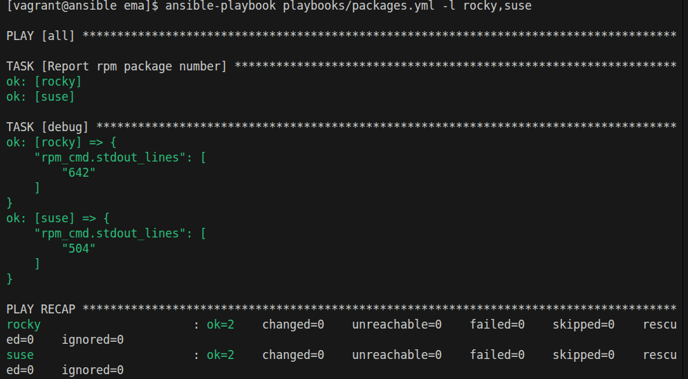

# Les variables enregistrées

Dossier de travail : `formation-ansible/atelier-15/`

Répertoire de travail dans la vm vagrant ansible : `~/ansible/projets/ema`

## Kernel info

```yml
--- # kernel.yml

- hosts: all
  gather_facts: false

  tasks:

    - name: Report kernel info
      command: uname -a 
      changed_when: false
      register: uname_cmd

    - debug:
        msg: "{{ uname_cmd.stdout_lines }}"
```



### Même chose avec `var`



## Packages info

```yml
--- # packages.yml

- hosts: all
  gather_facts: false

  tasks:

    - name: Report rpm package number
      shell: "rpm -qa | wc -l"
      changed_when: false
      register: rpm_cmd

    - debug:
        #msg: "{{ rpm.stdout_lines }}"
        var: rpm_cmd.stdout_lines
```

**output**
