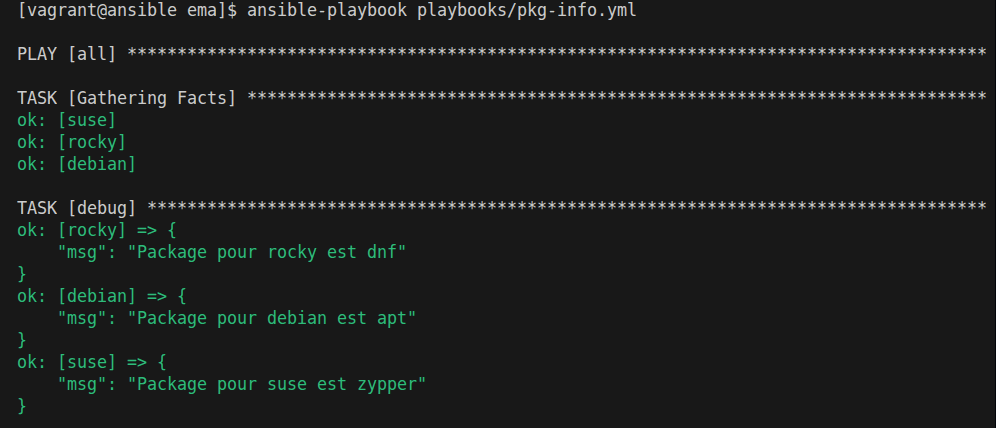
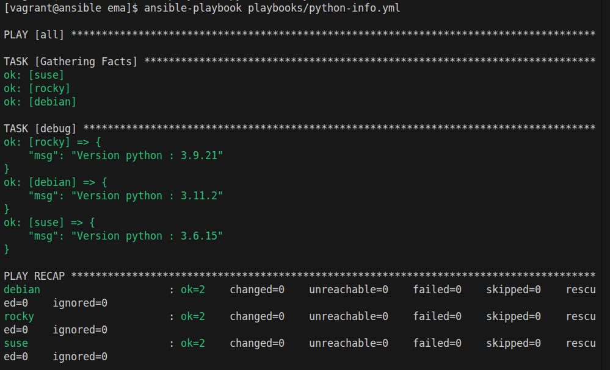
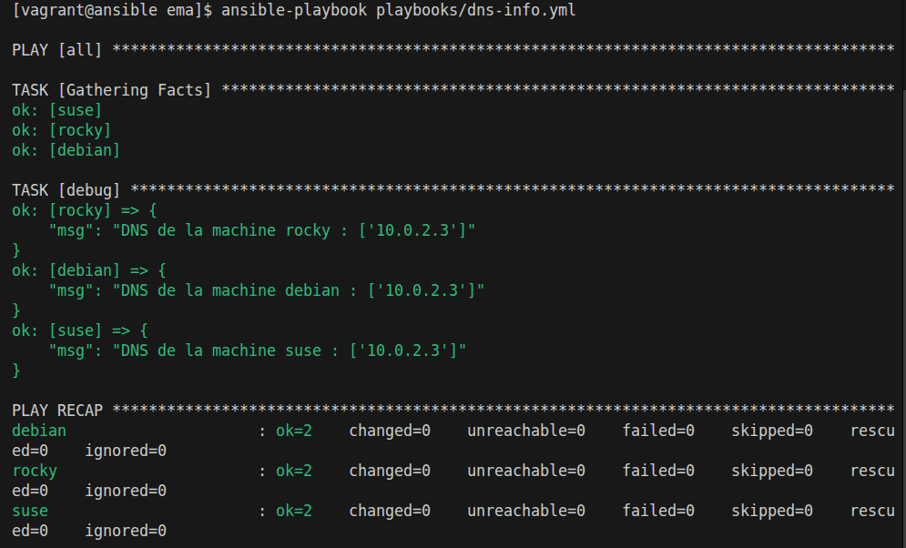

# Facts et variables implicites

Dossier de travail : `formation-ansible/atelier-16/`

Répertoire de travail dans la vm vagrant ansible : `~/ansible/projets/ema`

> utilisation de la commande `ansible debian -m setup` ainsi que [ansible community](https://docs.ansible.com/projects/ansible/latest/playbook_guide/playbooks_vars_facts.html) pour trouver les facts correspondant.

## Package manager

```yml
--- # pkg-info.yml

- hosts: all
  gather_facts: true

  tasks:

    - debug:
        msg: Package pour {{ ansible_facts.ansible_hostname }} est {{ ansible_facts.ansible_pkg_mgr }}
```




## Python - Version

```yml
--- # python-info.yml

- hosts: all
  gather_facts: true

  tasks:

    - debug:
        msg: "Version python : {{ ansible_python_version }}"
```

**output**




## DNS

```yml
--- # dns-info.yml

- hosts: all
  gather_facts: true

  tasks:

    - debug:
        msg: "DNS de la machine {{ ansible_hostname }} : {{ ansible_dns.nameservers }}"
```

**Outpupt**  
